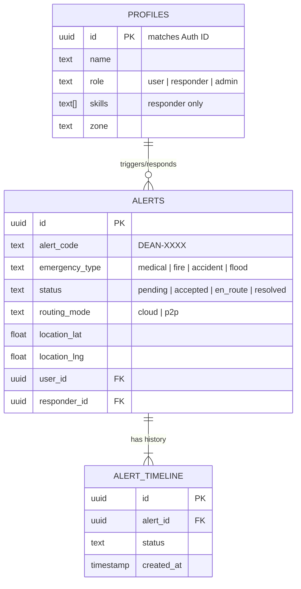

# D-EAN | Decentralized Emergency Assistance Network

**D-EAN** is a resilient emergency coordination platform designed for community-driven response. It ensures that SOS alerts are delivered to nearby responders whether the internet is working or not, using a unique dual-routing architecture.

## 🚀 Prototype Quick Start (Auth-Free)

This version of the platform has been optimized for rapid prototyping and demonstration. Standard authentication barriers have been removed to allow one-click access to all roles.

### 1. Database Setup (Supabase)
Run the following SQL in your **Supabase SQL Editor** to initialize the schema and enable unrestricted access:

```sql
-- Disable security barriers for prototype access
ALTER TABLE profiles DISABLE ROW LEVEL SECURITY;
ALTER TABLE alerts DISABLE ROW LEVEL SECURITY;
ALTER TABLE alert_timeline DISABLE ROW LEVEL SECURITY;
ALTER TABLE logs DISABLE ROW LEVEL SECURITY;

-- Create prototype identities with fixed IDs
DELETE FROM profiles;
INSERT INTO profiles (id, name, email, role)
VALUES 
  ('00000000-0000-0000-0000-000000000001', 'Arjun Rao', 'arjun@dean.com', 'user'),
  ('00000000-0000-0000-0000-000000000002', 'Riya Sharma', 'riya@dean.com', 'responder'),
  ('00000000-0000-0000-0000-000000000003', 'System Admin', 'admin@dean.com', 'admin');
```

### PWA Capabilities
- Offline asset caching for Leaflet resources
- Background synchronization manager via Service Workers

### 2. Environment Configuration
Create a `.env.local` file in the root directory:
```env
NEXT_PUBLIC_SUPABASE_URL=your_supabase_url
NEXT_PUBLIC_SUPABASE_ANON_KEY=your_anon_key
SUPABASE_SERVICE_ROLE_KEY=your_service_role_key
```

### 3. Installation & Data Sync
```bash
# Install dependencies
npm install

# Seed the prototype data
npm run seed

# Start development server
npm run dev
```

---

## 🛠 How It Works

### 1. Dual Routing Architecture
D-EAN monitors network connectivity in real-time. When a user triggers an SOS:
- **Cloud Mode (Online)**: Data is synced to Supabase. Responders are notified via Realtime subscriptions.
- **P2P Mode (Offline)**: If the internet is down, the system uses the **BroadcastChannel API** to create a local mesh network between open browser tabs on the same origin. Alerts are delivered locally and queued for synchronization once connectivity returns.

### 2. Role-Based Dashboards
- **Citizen (User)**: One-tap SOS triggering, location tracking, and responder arrival monitoring.
- **Volunteer (Responder)**: Live map of nearby alerts, mission acceptance, and status updates (En Route, Resolved).
- **Administrator**: Global overview of network activity, responder management, and system log exports.

### 3. Tech Stack
- **Frontend**: Next.js 14 (App Router), Tailwind CSS, Framer Motion.
- **Database/Auth**: Supabase (PostgreSQL, Realtime).
- **Mapping**: React-Leaflet with custom vector markers.
- **State/Network**: React Context API + custom BroadcastChannel hooks.

---

## ⚠️ Critical Troubleshooting

### "Map Container Already Initialized"
If you see this error, it is usually due to Hot Module Replacement (HMR). The platform uses unique `key` props on Map components to ensure Leaflet cleans up correctly during re-renders.

### Wrong Next.js Version (v16 Error)
If your terminal reports **Next.js 16.2.4**, your environment is corrupted by a parent-folder lockfile. 
**Solution**: 
1. Delete any `package-lock.json` in the parent folders (e.g., `C:\projects\package-lock.json`).
2. Delete `node_modules` and `package-lock.json` in the `DEAN` folder.
3. Run `npm install`.

## 📊 Database Architecture

The platform uses a relational PostgreSQL schema (via Supabase) designed for high-speed lookups and mission tracking.

### Schema Relationship Diagram


### Table Descriptions
- **`profiles`**: Extended user data. The `id` matches the Supabase Auth UUID.
- **`alerts`**: Stores current emergency state and geolocation.
- **`alert_timeline`**: An immutable ledger of every status change for an alert, used for analytics and responder performance tracking.
- **`logs`**: General system audit trail for admin oversight.

---

## 🏗 Built for Mangaluru
Designed to provide a safety net for local communities during natural disasters or network outages.


### Offline Test Validation

Verify service worker states and IndexedDB storage offline synchronization configurations in local Chrome/Firefox developer utilities.